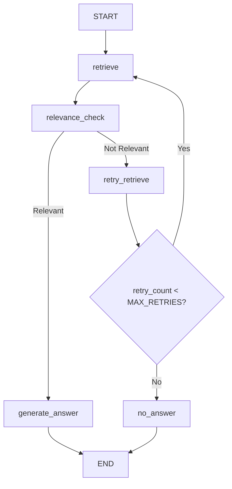

## LangGraph Workflow

The application uses **LangGraph** to orchestrate the Retrieval-Augmented Generation (RAG) pipeline. The workflow retrieves relevant document chunks from Pinecone, evaluates their usefulness, optionally retries retrieval when context is insufficient, and finally generates a grounded answer with citations.

### Graph Diagram



### Nodes

#### 1. `retrieve`

- Converts the user question into an embedding using **BAAI/bge-small-en-v1.5**
- Searches Pinecone for relevant chunks
- Filters weak matches using a similarity threshold
- Stores retrieved chunks in the graph state

**Output**

```python
{
    "retrieved_chunks": [...]
}
```

---

#### 2. `relevance_check`

- Uses **Gemini 2.0 Flash** to determine whether the retrieved context can answer the question
- Acts as a guardrail against irrelevant retrieval
- Returns a boolean decision

**Output**

```python
{
    "is_relevant": True | False
}
```

---

#### 3. `retry_retrieve`

- Triggered when the retrieved context is not sufficient
- Increments the retry counter
- Allows another retrieval attempt before failing

**Output**

```python
{
    "retry_count": state["retry_count"] + 1
}
```

---

#### 4. `generate_answer`

- Generates a grounded answer using the retrieved context
- Returns citations containing source files and chunk IDs

**Output**

```python
{
    "answer": "...",
    "citations": [...]
}
```

---

#### 5. `no_answer`

- Triggered when the retry limit is reached
- Returns a safe fallback response instead of hallucinating

**Output**

```python
{
    "answer": "I could not find the answer in the provided documents.",
    "citations": []
}
```

### Routing Logic

1. Retrieve relevant chunks from Pinecone.
2. Check whether the retrieved context can answer the question.
3. If relevant, generate the final answer.
4. If not relevant, increment the retry counter and retry retrieval.
5. If the retry limit is reached, return a safe fallback response.

Current configuration:

```python
MAX_RETRIES = 2
```

### Why Use an LLM for Relevance Checking?

Vector similarity alone does not guarantee that a retrieved chunk actually contains the answer.

A chunk may be semantically similar to the question but still lack the specific information being asked.

The relevance check uses Gemini Flash to verify whether the retrieved context is sufficient before answer generation. This improves grounding and reduces hallucinations.

### Graph State Schema

```python
class GraphState(TypedDict):
    question: str
    retrieved_chunks: List[Dict[str, Any]]
    is_relevant: bool
    answer: str
    citations: List[Dict[str, str]]
    retry_count: int
```
