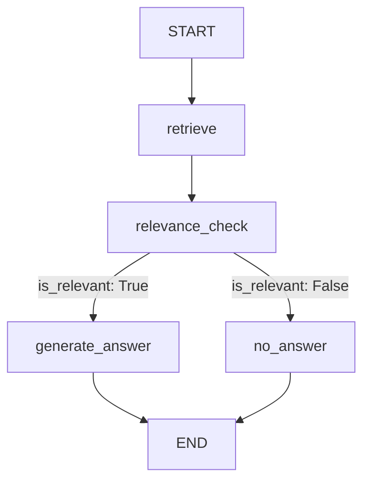

Here's a clean, well-formatted Markdown section for the **LangGraph Workflow**:

## LangGraph Workflow

The application uses **LangGraph** to orchestrate the entire RAG pipeline — from retrieval to relevance evaluation and final answer generation. This graph-based approach provides clear control flow, easy debugging, and explicit branching between the "good path" (relevant context found) and "bad path" (insufficient context).

### Graph Diagram



### Nodes

#### 1. `retrieve`
- Converts the user question into an embedding using BAAI/bge-small-en-v1.5
- Performs vector search in Pinecone
- Filters results using a similarity threshold
- Returns the top relevant document chunks

**Output:**
```python
{
    "retrieved_chunks": [...]
}
```

#### 2. `relevance_check`
- Uses **Google Gemini 2.0 Flash** to evaluate whether the retrieved chunks contain sufficient information to answer the question
- Acts as a hallucination guardrail
- Returns a boolean decision

**Output:**
```python
{
    "is_relevant": True | False
}
```

#### 3. `generate_answer`
- Generates a natural, grounded response using the retrieved chunks
- Produces accurate citations linked to source documents and chunk IDs

**Output:**
```python
{
    "answer": "...",
    "citations": [...]
}
```

#### 4. `no_answer`
- Triggered when relevant context is insufficient
- Returns a safe, non-hallucinated response

**Output:**
```python
{
    "answer": "I could not find the answer in the provided documents.",
    "citations": []
}
```

### Routing Logic

After the `relevance_check` node, the graph routes dynamically:
- If `is_relevant == True` → `generate_answer`
- If `is_relevant == False` → `no_answer`

This branching satisfies the assignment requirement for both a successful retrieval path and a graceful failure path.

### Graph State Schema

```python
class GraphState(TypedDict):
    question: str
    retrieved_chunks: List[Dict[str, Any]]
    is_relevant: bool
    answer: str
    citations: List[Dict[str, str]]
    retry_count: int
```

The state is passed between nodes and updated incrementally during graph execution.
